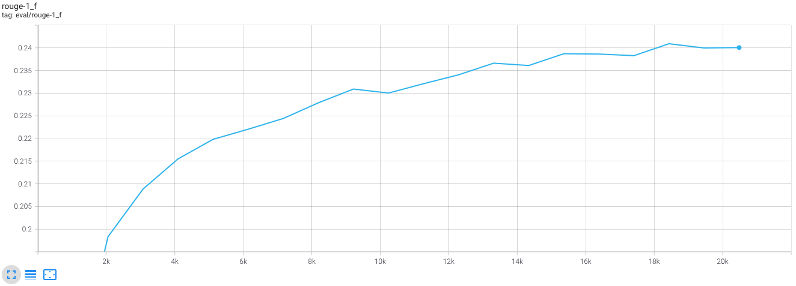
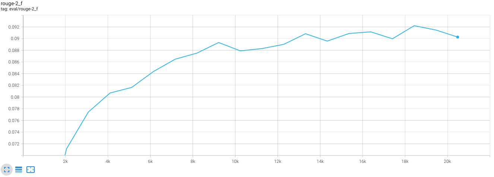
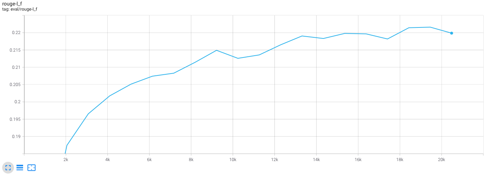

# Applied Deep Learning - Homework 3

###### Written By: Wu-Jun Pei (B06902029)

### Q1: Model (2%)

#### <u>1) Model</u>

Following the guides on the slides, I mainly use a Seq2seq-style <u>T5</u>, including a T5Encoder, T5Decoder and a fully-connected layer on top of decoder to output the probability of each token. More formally, let

- $e_i$ to be the encoder input token id for the $i$-th encoder input token, and $d_i$ to be the decoder input token id for the $i$-th decoder input token
- the hidden state of each encoder input $h_{e_i}$ can be obtained by $h_{e_{1..L}} = \text{T5Encoder}(e_{1..L})$
- the hidden state of each decoder input $h_{d_i}$ can be obtained by $h_{d_{1..L'}} = \text{T5Decoder}(d_{1..L'}, h_{e_{1..L}})$
- finally, the output token $o_i$ is obtained using the fully-connected head, $o_i = \text{LMHead}(h_{d_i})$

The pretrained weight I used is `google/mt5-small` following the suggestions from TAs.

#### <u>2) Preprocessing</u>

- We first tokenize the main text to tokens. After that, the token sequence is padded and truncated to length = 384.
- We first tokenize the title into tokens. After that, the token sequence is padded and truncated to length = 96.

### Q2: Training (2%)

#### <u>1) Hyperparameters</u>

- **Optimizer**: <u>Adam</u> with learning rate <u>1e-4</u> and weight decay <u>5e-5</u> with <u>linear learning rate scheduler (min_lr = 0)</u>
- **Epochs**: <u>20</u> (the total training time is about <u>6 hours</u>, and about one third of total training time is for evaluation)
    - The model mistakenly stopped at 20k steps because the disk space remaining on my device was not adequate, leading to a 
- **Batch size**: <u>2</u> for training and <u>4</u> for evaluation
- **Gradient accumulation**: the gradient is accumulated for <u>8</u> steps
- **FP16**: activated

#### <u>2) Learning Curve</u>

> The evaluation is performed every <u>1024</u> training steps. The generation strategy is <u>greedy</u> as it's the default strategy.

- **Rouge-1**
    
- **Rouge-2**
    
- **Rouge-L**
    

### Q3: Generation Strategies (6%)

#### <u>1) Strategies</u>

- **Greedy**: Always use the token with the highest probability
- **Beam search**: Maintain the top *num_beams* sequences with top probability. Greedy can be considered a special case of beam search when *num_beams = 1*
- **Top-k sampling**: Sample only from the top *k* tokens.
- **Top-p sampling**: Sample only from the top tokens where the total probability of token pool is larger than *p*.
- **Temperature sampling**: Controls the diversity of the outcome from sampling. The *temperatrure* is actually the denominator of logits before calculating softmax.

#### <u>2) Hyperparameters</u>

| Description                 | Rouge-1 | Rouge-2 | Rouge-L | Time (mm:ss) |
| --------------------------- | ------- | ------- | ------- | --------------- |
| Greedy                      | 23.8308 | 9.0921  | 22.3980 | 01:38           |
| Beam search (num_beams = 3) | 25.1437 | 10.2419 | 23.4102 | 04:30           |
| Beam search (num_beams = 5) | 25.3738 | 10.4971 | 23.6096 | 07:09           |
| Sampling baseline           | 19.4593 | 6.5109  | 17.7335 | 02:01           |
| Sampling (num_beams = 3)    | 24.6182 | 9.7992  | 22.8299 | 05:26           |
| TopK sampling (k = 10)      | 21:5361 | 7.5299  | 19.7783 | 02:01           |
| TopK sampling (k = 25)      | 20.1094 | 6.7752  | 18.4633 | 02:01           |
| TopP sampling (p = 0.25)    | 23.6406 | 8.9559  | 22.1158 | 05:14           |
| TopP Sampling (p = 0.5)     | 22.9461 | 8.5789  | 21.2561 | 04:58           |
| Temperature (t=0.5)         | 23:0771 | 8.6066  | 21.3575 | 01:59           |
| Temperature (t=2)           | 10.6780 | 1.9175  | 9.5607  | 02:31           |

#### <u>3) Final Strategy</u>

My final strategy is <u>beam search (num_beams = 3)</u>. With this strategy, I achieved the following metrics on validation dataset (`public.jsonl`).

- Rouge-1: <u>25.1437</u>
- Rouge-2: <u>10.2419</u>
- Rouge-L: <u>23.4102</u>

The entire prediction process takes about <u>04:30</u> on my PC equipped with a 8G 2070 Super GPU.
